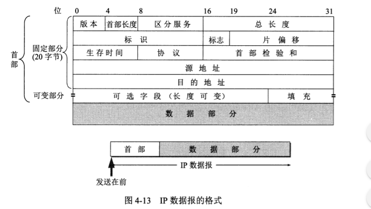

# ip 协议配套使用的三个协议
- 地址解析协议 ARP（address resolution protocol）
- 网际控制报文协议 ICMP （Internet control message protocol）
- 网际组控制协议 IGMP（internet group management protocol）

# 一般来讲将网络互连起来还需要其他的一些中间设备
- 物理层使用的中间设备叫做 转发器
- 数据链路层使用的中间设备是 网桥
- 网络层使用的中间设备是 路由器
- 在网路层以上的中间设备是 网关

# 路由器其实就是一台计算机，用来在互联网上的路由选择，由于历史原因

# 分类的 ip 地址 32位 ，每8位表示一个数字2^8即从0-255，一个字节byte 表示八位
分类的ip地址就是将IP地址分为若干个固定类， 网络号 + 主机号 = ip 地址
A,B,C 类地址为单播地址
- A类地址 第一个八位表示网络号第一位 /^0\d{7}$/， 剩下的24位表示主机号
- B类地址，前两个八位表示网络号/^(10)\d{14}$/，剩下的两个八位表示主机号
- C类地址，前三个八位表示网络号/^(110)\d{21}$/，剩下的一个八位表示主机号
- D类地址为多播地址，/^(1110)\d{28}$/
  
A类地址的网络号字段站一个字节，只有7位可使用，第一位以固定为0，
但是可以指派的网络号是126 （2^7-2）减2的原因是
- 第一IP全是0表示 this（00000000）, 网络号全是0是个保留地址，指的是本网络
- 第二网络号为127（01111111）保留作为回环测试本主机的进程之间的通信，回环地址的IP数据报不会出现在网络上
## A类地址的主机号占3个字节，因此A类网络最大分配主机数是 2^24-2
- 主机号减2的原因是，第一都为0，全为0的主机号字段表示该ip地址为 ‘本机地址’ 所连接到的单个网络地址
- 第二都为1，表示主机号表示该网络上的所有主机，11111111，00000000
- ip地址空间一共有2^32个地址，A类地址2^31占据50% (前面第1位固定)

## B类地址网络号占据2个字节前面2为固定位10，剩下14位可分配，主机号占据两个字节
- 因为10已经固定，所以在分配也不可能是全0或1的情况，因此不用减2，但是128.0.0.0这个ip地址是不可分配的，因此网络号可分配地址为2^14-1, 主机号可分配地址为2^14-2
- 这里的主机号减2的原因还是因为不能都是1或者0，11111111，00000000
- B类地址占据2^30为25% （前面2位固定）

# C类地址网络号占据三个字节，前面三位固定110，还有21位可分配，C类网络地址129.0.0.0 是不可指派的，因此C类的网络总数是 2^21-1, C类的主机数2^8-2 
- 这里的主机号减2的原因还是因为不能都是1或者0，11111111，00000000
- C类地址占据2^29为12.5% （前面3位固定）

## ip地址与硬件地址
- 物理地址是数据链路层和物理层使用的地址，ip地址是网络层和以上使用的地址，是逻辑地址
- ip地址放在ip数据报的首部，而硬件地址放在MAC帧的首部，在网络层和网络层以上使用的地址ip地址，数据链路层以及以下的层使用的是硬件地址
- 在ip层抽象的互联网上只能看到ip数据报
- 在局域网的链路层，只能看见MAC帧

## 地址解析协议ARP，例如我们知道一台机器的IP地址，现在需要找到这台机器的硬件地址，地址解析协议ARP就是用来解决ip地址找物理地址。ARP是网络层的协议
1. 同一个局域网下主机的下线，上线都会动态的分配ip地址，释放ip地址
2. 地址解析协议ARP解决这个问题是在主机ARP高速缓存中存放一个ip地址到硬件地址的映射表，并动态更新
3. 当主机A向同一个局域网下的主机B发送IP数据报时，就先在其ARP高速缓存中查看主机B的ip地址对应的硬件地址
4. 如果没有找到对应的硬件地址，就向本局域网下发送广播ARP请求
5. 我的ip地址 209.0.0.5, 硬件地址00-00-C0-15-AD-18, 我想知道ip地址为209.0.0.6的主机的硬件地址
6. 主机B的ip地址与ARP请求分组中要查询的IP地址一致，收下这个请求，并向主机A发送ARP响应分组，并把自己的硬件地址写在分组中。
7. ARP解决的是同一个局域网上的主机或路由器的ip地址和硬件地址映射问题，不同局域网下无法解析另一个局域网上的主机硬件地址

### why we 任然使用ip地址而不直接使用硬件地址，因为在全世界存在各式各样的网络，他们使用的是不同的硬件地址，要使这些异构网络能够互联必须进行非常复杂的硬件地址转换工作，因此由用户与用户主机完成几乎不可能的，因此IP地址完美解决了这个问题，每个主机都有唯一的ip地址，他们之间的通信就像连接在同一个网络上一样简单。

## IP数据报的格式

# 划分子网和构造超网
1. 从两级ipdi地址到三级ip地址
2. 早期的ip地址划分利用率很低，两级ip地址不够灵活
3. 未解决上面ip地址利用率提高，增强灵活性我们提出子网的概念，即增加一个 ‘子网号字段’， 使两级ip地址变成三级IP地址，叫做**划分子网**
4. 一个单位有很多网络，因此可以划分为多个子网，划分子网是企业内部的事，外部其他网络是看不见的
5. 划分子网的方法是向主机号借用若干位作为子网络号，当然主机号就相应的减少位数
6. 于是两级ip地址在单位内部可以变为三级地址 **IP地址 = 网络号 + 子网号 + 主机号**
   
## 子网掩码
