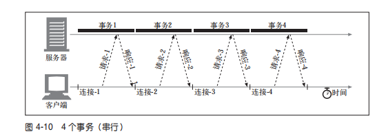
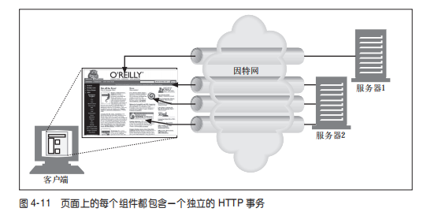

# web客户端和服务器

web 内容是存储在web服务器上的，web服务器使用的是HTTP协议，因此也经常说是HTTP服务器，HTTP服务器存储了因特网中的数据，如果HTTP客户端发出请求的话，他们会提供数据，客户端向服务器发送HTTP请求，服务器会发出HTTP响应中会送所请求的数据。

## web 服务器的web资源

最简单的web资源就是web服务器文件系统中的静态文件，这些文件可以是：文本文件，HTML文件，txt文件，excel, pdf, jpg, png, avi等电影文件，所有的文件格式，你能想到的都可以。

但web资源也可以是动态的，资源可以是根据需要生成内容的软件程序，这些动态内容资源可以根据你的身份，说请求的信息或者每天的不同时段来产生内容

## 资源类型，媒体类型

网上不计其数的资源类型不同，HTTP仔细给每种要通过web的HTTP协议传输的对象都要打上一个MIME类型的数据格式标签（MIME type multiprupose internet mail extension 多用途因特网邮件扩展）是为了解决在不同的电子邮件系统之间搬移文件时存在的问题。因为在邮件系统中的出色表现，所以HTTP也采用了这种方式。用它来标记不同文件类型。
MIME 类型是一种文本标记，表示一种主要的对象类型额一个特定的子类型，中间用斜杆分隔
**主对象类型/特定的子类型**

## URI = URL + URN

URI（uniform resource identifier）服务器资源名被称为统一资源表示符，他有两种形式URL和URN

## HTTP 连接的处理

connection首部，HTTP 允许在客户端和最终的源端服务器之间存在一串 HTTP 中间实体（代理、高速缓存等）。可以从客户端开始，逐跳地将 HTTP 报文经过这些中间设备，转发到源端服务器上去（或者进行反向传输）。

HTTP 的 connection 首部字段有一个由逗号分隔的连接标签列表，这些标签为此连接指定了一些不会传播到其他连接中去的选项。
可以用 Connection:close 来说明发送完下一条报文之后必须关闭的连接。

### 串行事务处理时延

如果只对连接进行简单的管理，那么TCP的性能时延可能会叠加起来

例如有个包含3个嵌入图片的web页面，浏览器需要发起4次HTTP事务来显示这个页面，1个用来顶层的HTML页面，3个用来嵌入的图片，如果每个事务都需要一条新的连接，那么连接时延和慢启动时延就会叠加起来，因此3个图片对象为接收到之前，导致页面处于空白状态

## 因此可以采用新的方法提高HTTP的连接性能 ，并行连接，持久连接，管道化连接

- 并行连接，通过多条TCP连接发起并发的HTTP请求
- 持久连接，重用TCP连接，以消除连接及关闭延时
- 管道化连接，通过共享的 TCP 连接发起并发的 HTTP 请求。

### 并行连接，允许执行多个HTTP并行事务，提高页面的加载速度，可以充分利用宽带

### 持久连接让HTTP事务处理完事之后，TCP连接保持在打开的状态，以便为未来的HTTP连接实现重用

1. 并行连接的缺点 每个事务都会打开、关闭一条新的连接会耗费时间和带宽
2. 由于TCP慢启动和拥塞控制的存在，每条新连接的性能都会降低
3. 可打开的并行连接数量是有限的
4. 持久连接比并行连接更好的地方是，持久连接降低了时延和连接建立的开销，减少了潜在的连接打开数量，但是这样会有可能出现大量空闲的连接，耗费了互联网的资源。

**因此持久连接和并行连接结合使用可能是最高效的方式，现在很多web应用程序都会打开少量的并行连接，其中的每条都是持久连接**，但是持久连接又分两种，一种是HTTP1.0+的keep-alive和主流使用的协议HTTP1.1的persistent连接

1. 早期的HTTP1.0+浏览器和服务器针对持久连接这块做了很多扩展， 但是有着设计的缺陷，随着HTTP1.1版本解决了这些问题，但是现在至今还有很多浏览器使用keep-alive,浏览器和服务器对 keep-alive 握手的使用仍然相当广泛。
客户端使用请求首部Connection: keep-alive向服务器保持持久连接，如果服务器支持持久连接，那么就会返回相同的Connection: keep-alive, 如果服务端不支持持久连接，那么响应报文首部就没有Connection或者Connection: close等

2. HTTP1.1的持久连接，HTTP1.1逐渐停止了对Keep-Alive连接，用（persistentconnection）持久连接的改进型设计取代了它。HTTP1.0+的默认情况下是支持持久连接的，除非指明Connection: keep-alive, 但是HTTP1.1的持久连接是默认激活的状态，除非设置客户端请求响应Connection：keep-alive
HTTP/1.1 客户端假定在收到响应后，除非响应中包含了 Connection: close 首
部，不然 HTTP/1.1 连接就仍维持在打开状态。但是，客户端和服务器仍然可以随
时关闭空闲的连接。不发送 Connection: close 并不意味着服务器承诺永远将连
接保持在打开状态。
