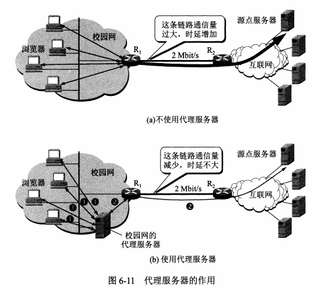
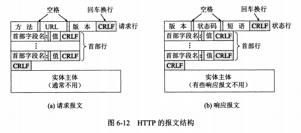
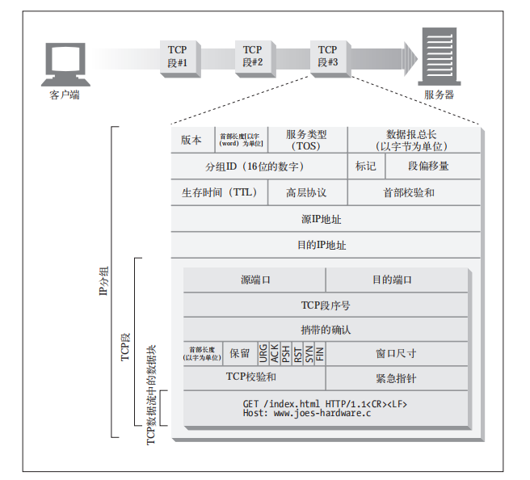

# 应用层协议 application layer protocol

通过位于不同主机中的多个应用进程之间的通信和协同工作来完成，进程之间的这种通信必须遵循严格的规则

- 应用进程交换的报文类型，如请求报文和响应报文
- 各种报文类型的语法，报文中的各种字段和详细描述
- 字段的语义，包含在字段中的信息的含义
- 进程什么时候，怎么发送报文，以及对报文进行相应的规则

## HTTP 超文本传输协议

## 域名系统 其实就是名字系统

用户访问某台主机时，虽然是通过ip地址访问，但是IP地址的32位长度，很难被记住，因此给ip地址命一个好听又有标志的名字是很有必要的，这就有了ip地址和命名的一一对应问题出现，但是又不能直接使用命名的名字访问目的主机，因为命名的域名是长度不定的。而ip地址是32位固定的比较好解析处理相对容易。
在计算机互联网早期，整个网上就是几百台计算机，那时候的IP地址和域名系统，都写在一个hosts的文件中，用户输入域名就能立马得到对应的IP地址。
**互联网的域名系统DNS被设计成一个联机分布式数据库系统。采用客户服务器方式，DNS使大多数名字都在本地进行解析，即使某个计算机出了故障，也不会影响整个DNS系统的正常运行。**
域名到ip地址的解析是由分布在互联网上的许多域名服务器程序共同完成的，域名服务器程序所在的机器称为域名服务器。

### 域名到ip的解析过程

- 当某个应用程序进程需要把主机名解析为IP地址时，该应用程序就调用解析程序，并成为DNS的一个客户，把带解析的域名放在DNS请求报文段中，以UDP用户数据报文方式发给本地的域名服务器（使用UDP是为了减少开销）。本地域名服务器在查找域名后，把对应的IP地址放在回答报文段中返回，应用进程获得目的主机的IP地址后即可进行通信。
- 若本地域名服务器没有找到该域名的IP地址，则该域名服务器发往下一个其他域名服务器，直到能够找到其他域名对应的IP地址为止。

### 互联网的域名结构

- 在早期的时候使用的是非等级的域名空间，优点是名字简短，但是随着用户爆炸式的增加，用非等级的名字空间管理一个很大的经常变化的名字集合是非常困难的。因此后来采用层次树状结构的命名方式。任何一个连接在互联网上的主机或路由器，都有唯一一个层次结构的名字。 **即域名 domain name** 域这里是指的空间的意思，一个域可以划分为子域，子域还可划分为子域，即有一级域名，二级域名，三级域名等等。
- 例如 mail.cctv.com, 其中 mail是三级域名，cctv是二级域名，com是顶级域名，其中每个标号限制在63个字符但是为了更好记忆我们一般不会超过12个字符，**也是不区分大小写的 CCTV和cctv 是同一个域名，除了连字符-以外，不能使用其他标点符号**
- 域名的书写规则是，最低等级的域名在最左边，最高等级的域名在最右边，整个域名不超过255个字符
- DNS域名是不限制一个域名需要有多少个子域名，也不限制每级域名代表的含义。
- 每一级的域名由上一级的域名管理机构管理，最高的顶级域名有ICANN进行管理。
- 这种方式的域名在整个互联网范围是唯一的，也是容易设计域名查找的机制。
- 域名只是一个逻辑的概念，而32位定长的二进制数更适合机器处理。
- 域名中的“点(.)” 和 ip地址中的"点(.)"是没有半毛钱的关系的。

### 顶级域名的三大类


1. 国家顶级域名cn(中国)、us(美国)、uk(英国)
1. 通用顶级域名com(公司企业)、net(网络服务机构)、org(非盈利性的组织)、edu(教育机构)、gov(政府部门)等等
1. 基础结构域名，这种域名只有一个arpa用于反向域名解析
1. 中国顶级域名为cn, 中国把二级域名划分为 “类别域名”和“行政区域名”

- 类别域名分为七个，ac(科研机构)、com(工，商，金融企业)、edu(教育机构)、gov(政府机构)、net(网络服务机构)、org(非盈利性的组织)、mil(国防机构)
- 行政区域名，各省，自治区，直辖市，北京（bj）上海（sh）

### 域名服务器


1. 根域名服务器，是域名服务器的最高层次，也是最重要的域名服务器，所有根域名服务器都知道所有的顶级域名和ip地址。如果本地服务器不能够解析域名，就首先要向根域名服务器求助，如果所有根域名服务器go die那么互联网也就go die了，全世界已经安装了近600台根服务器，大多数是由专门的域名服务器公司管理或者美国政府部门管理，多数情况下，根服务器不会直接把要查询的域名转换为ip地址，而是告诉本地域名服务器下次应该查询哪个顶级域名服务器。
2. 顶级域名服务器，顶级域名服务器负责管理该域名下的所有二级域名服务器，当收到DNS查询请求时，就给出相应的回答，这个回答可能是下一步应当找的域名服务器ip地址，也可能是最后的结果。
3. 权限域名服务器，负责一个区的域名服务器, 当这个域名服务器还不能给出最后的查询结果时，就会告诉发出请求的DNS客户，下一步应该找哪一个权限域名域名器
4. 本地域名服务器，每一个互联网服务商isp, 一个大学，一个医院，都有本地域名服务器，这种域名服务器有时候是默认域名服务器
5. 在windows系统中在，控制面板-->网络和Internet-->网络和共享中心-->查看网络状态和任务-->无线网络连接——>属性-->Internet协议版本4-->属性，这里可以看到首选DNS服务器和备用DNS服务器，这里的DNS服务器指的就是本地域名服务器。
6. 本地服务器距离用户比较近，一般不会超过几个路由器的距离。

## 域名解析过程

- **主机向本地域名服务器的查询一般都是采用递归查**，意思就是本地服务器如果没有找到域名对应的ip地址，那么本地域名服务器就充当DNS客户，向下一个域名服务器查询域名对应的ip地址，直到找到为止。
- 还有一种就是，**本地域名服务器向根域名服务器的查询通常是采用迭代查询**，迭代查询的特点是：当根域名服务器收到本地域名服务器发出的迭代查询请求时，要么给出查询的IP地址，要么告诉本地域名服务器下一个应该查询哪一个域名服务器，然后本地域名服务器在查询根据根域名服务器给的顶级域名服务器ip地址，这样迭代查询。


## 远程终端协议 TELNET telnet

用户用Telnet就可在其所在地通过TCP连接注册到远程的另一台主机上（使用主机名或者ip地址），Telnet能够将用户的输入设备和远程的主机连接，同时远程的主机的输出也能通过TCP连接显示在用户屏幕上，这种服务是透明的，就好像用户的主机和远程的主机是相连接的。称这种连接方式是**终端仿真协议**

## 文件传送协议

FTP 文件传送协议 FTP （file transfer protocol）是使用最广的文件传送协议。FTP协议是基于TCP可靠报文传输协议的
TFTP 简单文件传送协议 （trivial file transfer protocol） 是基于UDP报文段的传送协议。

## 万维网 www (world wide web) 是一个大规模的联机式的信息储存所，可以很方便的从互联网上一个站点访问另一个站点，主动获取非常丰富的信息资源


正是因为万维网的出现，使得互联网呈现爆炸式的增长，普通人也可以通过互联网获取信息资源。
万维网最初是欧洲粒子物理实验室提出的 ，93年推出第一个图形界面版的浏览器器browser Mosaic, 随后95年网景公司推出
netscape navigator 浏览器上市，但是目前装机最多的还是 internet explorer

万维网是一个分布式的超媒体系统，他是超文本系统的扩充，超媒体和超文本区别是：超媒体包含：文本，图形，图像，音频，视频，动画等等，而超文本系统仅仅包含文本信息

分布式和非分布式的系统也有很大区别： 非分布式的各种信息资源都是放在单个计算机的磁盘中。

## 万维网解决的三个基本问题

- 使用URL（统一资源定位符）标志分布在整个互联网上的万维网文档
- 使用HTTP（超文本传输协议）实现万维网上的各种链接
- 使用HTML（超文本标记语言）统一万维网的文档编写格式

### URL 统一资源定位符 <协议>://<主机>:<端口>/<路径>;<params>?<query>#<frag>

- params 参数用分号（;）将参数和其他部分分开 https://www.baidu.com/public;type=view/imgae;type=png 意思是public路径片段参数type为view和image路径片段的参数type为png
- query 比如在image为png的有很多图片资源，我们想要获取某个特定的资源，那么查询参数就可以用上https://www.baidu.com/inventory-check.cgi?item=12731&color=blue&size=large 中的item和color和size为query
协议规定用什么协议来访问该万维网，HTTP，FTP等等，主机这里是指的域名，端口和路径有时可省略
在浏览器地址栏输入url时，可省略协议号和www, 直接输入bai.com, 浏览器自动会补全https://wwww.baidu.com
url是部分大小写的

## HTTP 超文本传输协议 HTTP

1. HTTP 是面向事务的应用层协议


1. 每个万维网网店的web服务器进程，他不断的监听TCP的端口80, 用于发现是否有浏览器向它发送连接请求，一但发现连接建立请求并建立了TCP连接之后，浏览器就向万维网服务器发出浏览某个页面的请求，服务器接着就返回所请求的页面作为响应，最后TCP姐俩就被释放了，这个浏览器和服务器的请求和响应的交互，必须按照HTTP超文本传输协议来进行。
1. HTTP使用了面向连接的TCP作为运输层协议，保证了数据的可靠性，但是HTTP协议本身是无状态的、无连接的，因此在交换HTTP报文之前不需要先建立HTTP连接，97年之前使用的是HTTP1.0, 现在使用的是HTTP1.1版本
1. HTTP是无状态的，因此第一次连接和第N次连接是一毛一样的
1. 从浏览器请求一个万维网文档到手当整个文档所需的时间，即发送请求到得到响应的时间，首先要建立TCP连接这需要三次握手，当建三次握手的前两部分完成后(RTT), 浏览器就把HTTP请求报文发给服务器，作为建立TCP连接的三次报文握手中的第三个报文的数据。发送给万维网服务器，服务器接收到HTTP请求报文后，就把所请求的文档作为响应报文返回给客户


### 先说HTTP1.0的缺点，从上面可以看出每次请求一个文档就要花费两个RTT的时间,如果页面上有很多要链接的对象比如图片，那么每次都需要两个RTT时间

如果一个网页有很多的图片链接，那么每次链接下载都会导致2RTT的往返时间的开销，这种非持续性的连接会使得万维网服务器的负担很重。
but(周星星的电影太迟)，互联网的发展速度只有你想不到没有做不到，我们呢光速推出HTTP1.1版本的超文本协议，完美的解决了这个问题，使用持续性的连接，持续性的连接关键就在于在万维网服务器在发送响应后任然有段时间内的保持连接，使同一个客户端和服务器可以继续在这条连接上进行HTTP的报文请求和响应，只要是这个服务器上的所有文档都可以使用这条连接，目前所有的浏览器都是默认的HTTP1.1

### HTTP1.1 持续性的连接有两种方式，一个非流水线方式，和流水线方式

- 非流水线方式的特点是：客户在收到前一个响应后才发出下一个请求(TCP有点像停止等待协议)，因此在建立TCP连接后，客户没访问一次对象都要用一个往返时间RTT，这种非持续性的连接

### 代理服务器 proxy server

代理服务器是一个网络实体，又称为万维网的高速缓存，代理服务器就是把最近的一些请求和响应暂存到本地磁盘中，当新来请求和暂存区的请求相同就会把暂存区对应的响应发送给客户端，如果新来的请求在代理服务器上没有的话，那么代理服务器代替客户端，向互联网其他服务器发送请求，得到相应之后暂存请求和响应并返给客户端。


## HTTP的报文格式


HTTP的报文格式分三个部分

- 开始行， 在请求报文部分叫请求行，在响应报文部分叫状态行 最后的CRLF分别代表CR回车，LF代表换行
- 首部行，用于说明浏览器，服务器，报文主体的描述信息，每行结尾用CRLF，并且在首部的最后使用一个整行的空行用于首部和主体分开，通用首部，请求首部，响应首部，实体首部
- 实体主体，一般请求报文中可以没有该字段，响应报文中也可以没有该字段。
- 请求方法

method | description
---- | ---
OPTION | 请求一些选项的信息
HEAD |  请求读取由URL所标志的信息的首部
GET | 请求读取由URL所标志的信息
POST |  给服务器添加信息
DELETE | 删除指明的URL所标志的资源
PUT |  在指明的URL下存储一个文档
TRACE | 用来进行回环测试的请求报文
CONNECT |  用于代理服务器

- 状态码（status-code）三个数字分五大类

整体范围 | 已定义范围 | 描述
---- | --- | ---
100-199 | 100-101 | 提示信息
200-299 | 200-206 | 成功
300-399 | 300-305 | 重定向
400-499 | 400-415 | 客户端错误
500-599 | 500-505 | 服务端错误

1. 1XX表示通知信息，请求收到了正在进行处理

状态码 | 原因短句 | 描述
---- | --- | ---
100 | continue| 说明收到了请求的初始部分，请客户端继续。发送了这个状态码之后，服务器在收到请求之后必须进行响应。
101 | Switching Protocols | 说明服务器正在根据客户端的指定，将协议切换成 Update 首部
所列的协议

1. 2XX表示成功， 接受或者知道了

状态码 | 原因短句 | 描述
---- | --- | ---
200 | ok | 请求没问题，实体的主体部分包含了所请求的资源
201 | created | 用于创建服务器对象的请求（比如，PUT）。响应的实体主体部分中应该包含各种引用了已创建的资源的 URL，Location 首部包含的则是最具体的引用。
204 | No Content | 响应报文中包含若干首部和一个状态行，但没有实体的主体部分。主要用于在浏览器不转为显示新文档的情况下，对其进行更新

1. 3XX表示重定向，如完成请求还需进一步处理

重定向状态码要么告知客户端使用替代位置来访问他们所感兴趣的资源，要么就提供一个替代的响应而不是资源的内容。如果资源已被移动，可发送一个重定向状态码和一个可选的 Location 首部来告知客户端资源已被移走，以及现在可以在哪里找到它

状态码 | 原因短句 | 描述
---- | --- | ---
300 | Multiple Choices | 客户端请求一个实际指向多个资源的 URL 时会返回这个状态码，比如服务器上有某个 HTML 文档的英语和法语版本。返回这个代码时会带有一个选项列表；这样用户就可以选择他希望使用的那一项了。有多个版本可用时，客户端需要沟通解决
301 | Moved Permanently | 在请求的 URL 已被移除时使用。响应的 Location 首部中应该包含资源现在所处的 URL
302 | Found | 与 301 状态码类似；但是，客户端应该使用 Location 首部给出的URL 来临时定位资源。将来的请求仍应使用老的 URL
303 | See Other | 告知客户端应该用另一个 URL 来获取资源。新的 URL 位于响应报文的 Location 首部。其主要目的是允许 POST 请求的响应将客户端定向到某个资源上去
304 | Not Modified | 客户端可以通过所包含的请求首部，使其请求变成有条件的。如果客户端发起了一个条件 GET请求，而最近资源被修改的话，就可以用这个状态码来说明资源未被修改。带有这个状态码的响应不应该包含实体的主体部分

1. 4XX表示客户的差错，如请求中有错误的语法或不能完成

状态码 | 原因短句 | 描述
---- | --- | ---
400 | bad request | 告知客户端这是一个坏的请求
401 | unauthorized 未经授权| 与适当的首部一同返回，在这些首部中请求客户端在获取对资源的访问权之前，对自己进行认证。
403 | Forbidden 禁止 | 用于说明请求被服务拒绝了如果服务器想说明为什么拒绝请求，可以包含实体的主体部分来对原因进行描述。但这个状态码通常是在服务器不想说明拒绝原因的时候使用的
404 | not found | 用于说明服务器无法找到请求的URL通常会包含一个实体，以便客户端应用程序显示给用户看
405 | methods not allowed | 发起请求的url方法不支持

1. 5XX表示服务器的差错，服务器无法去完成请求

状态码 | 原因短句 | 描述
---- | --- | ---
500 | Internal server error | 服务器遇到一个妨碍它为请求提供服务的错误时，使用此状态码
501 | not implemented 不实施 | 客户端发起的请求超出服务器的能力范围（比如，使用了服务器不支持的请求方法）时，使用此状态码
502 | bad gateway | 作为代理或网关使用的服务器从请求响应链下一条链路上收到了一条伪响应（比如，它无法连接到其父网关）时，使用此状态码
503 | service unavailable 暂停服务 | 用来说明服务器现在无法为请求提供服务，但将来可以
504 | gateway timeout 网关超时 | 只是这里的响应来自一个网关或代理，它们在等待另一服务器对其请求进行响应时超时了
505 | HTTP version not supported 协议版本不支持 | 服务器收到的请求使用了它无法或不愿支持的协议版本时，使用此状态码

### 请求报文的格式和响应报文的格式

请求报文

``` js
 <method> <url> <version>
 <headers>

 <entity-body>

```

响应报文

``` js
 <version> <status> <reason> 原因短句
 <headers>

 <entity-body>
 ```

## 通用首部，请求首部，响应首部，实体首部

- 通用首部
在客户端和服务端都有这种的首部

通用首部 | 描述
---- | ---
Connection | 允许客户端和服务端指定请求、响应连接有关的选项
Transfer-Encoding | 告知接收端为了保证报文的可靠传输，对报文采用了什么编码方式
Date | 提供日期和时间标志，说明报文是什么时间创建的
Cache-Control | 用于随报文传送缓存指示
Pragma | 另一种随报文传送指示的方式，但并不专用于缓存

- 请求首部
请求首部是只在请求报文中有意义的首部。用于说明是谁或什么在发送请求、请求源自何处，或者客户端的喜好及能力。
Accept首部 Accept 首部为客户端提供了一种将其喜好和能力告知服务器的方式，包括它们想要什么，可以使用什么，以及最重要的，它们不想要什么
安全请求首部HTTP 本身就支持一种简单的机制，可以对请求进行质询 / 响应认证。这种机制要求客户端在获取特定的资源之前，先对自身进行认证，这样就可以使事务稍微安全
一些。

请求首部 | 描述
---- | ---
Client-IP | 提供了运行客户端的机器的 IP 地址
From | 提供了客户端用户的 E-mail 地址 9
Host | 给出了接收请求的服务器的主机名和端口号
Referer | 提供了包含当前请求 URI 的文档的 URL
UA-Color | 提供了与客户端显示器的显示颜色有关的信息
UA-CPU10 | 给出了客户端 CPU 的类型或制造商
UA-Disp | 提供了与客户端显示器（屏幕）能力有关的信息
UA-OS | 给出了运行在客户端机器上的操作系统名称及版UA-Pixels 提供了客户端显示器的像素信息
User-Agent | 将发起请求的应用程序名称告知服务器

accept首部 | --
---- | ---
Accept | 告诉服务器能够发送哪些媒体类型
Accept-Charset | 告诉服务器能够发送哪些字符集
Accept-Encoding | 告诉服务器能够发送哪些编码方式
Accept-Language | 告诉服务器能够发送哪些语言

安全首部 | --
---- | ---
Authorization | 包含了客户端提供给服务器，以便对其自身进行认证的数据
Cookie | 客户端用它向服务器传送一个令牌——它并不是真正的安隐含了安全功能
Cookie2 | 用来说明请求端支持的 cookie 版本

- 响应首部
响应报文有自己的响应首部集。响应首部为客户端提供了一些额外信息，比如谁在发送响应、响应者的功能。

响应首部 | 描述
---- | ---
Age | （从最初创建开始）响应持续时间 16
Public | 服务器为其资源支持的请求方法列表
Retry-After | 如果资源不可用的话，在此日期或时间重试
Server | 服务器应用程序软件的名称和版本
Title | 对 HTML 文档来说，就是 HTML 文档的源端给出的标题
Warning | 比原因短语中更详细一些的警告报文

安全响应首部
我们已经看到过安全请求首部了，本质上这里说的就是 HTTP 的质询 / 响应认证机
制的响应侧。

安全响应首部 | --
---- | ---
proxy-Authenticate | 来自代理的对客户端的质询列表
Set-Cookie | 不是真正的安全首部，但隐含有安全功能；可以在客户端设置一个令牌，
以便服务器对客户端进行标识
Set-Cookie2 | 与 Set-Cookie 类似
WWW-Authenticate 来自服务器的对客户端的质询列表

- 实体首部
请求报文和响应报文都有实体首部，实体首部提供了有关实体及其内容的大量信息，从有关对象类型的信息，到能够对资源使用的各种有效的请求方法。总之，实体首部可以告知报文的接收者它在对什么进行处理。

实体首部 | --
---- | ---
Allow | 列出了可以对此实体执行的请求方法
Location | 告知客户端实体实际上位于何处；用于将接收端定向到资源的（可能是新
的）位置（URL）上去
Content-Base | 解析主体中的相对 URL 时使用的基础 URL
Content-Encoding | 对主体执行的任意编码方式
Content-Language | 理解主体时最适宜使用的自然语言
Content-Length | 主体的长度或尺寸
Content-Location | 资源实际所处的位置
Content-MD5 | 主体的 MD5 校验和
Content-Range | 在整个资源中此实体表示的字节范围
Content-Type | 这个主体的对象类型


