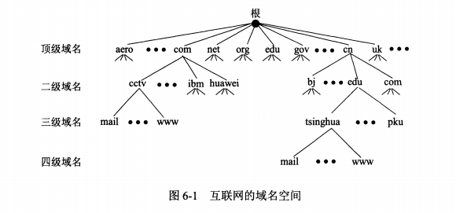
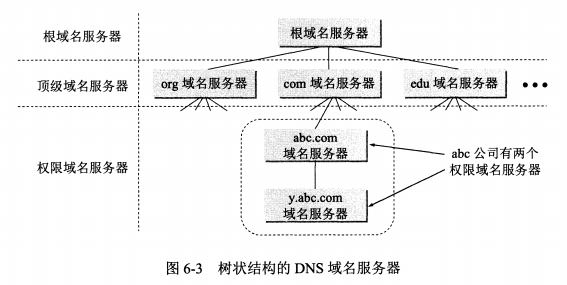
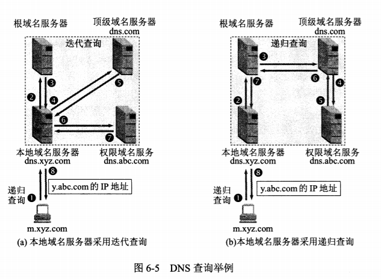
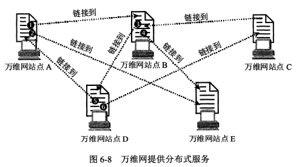
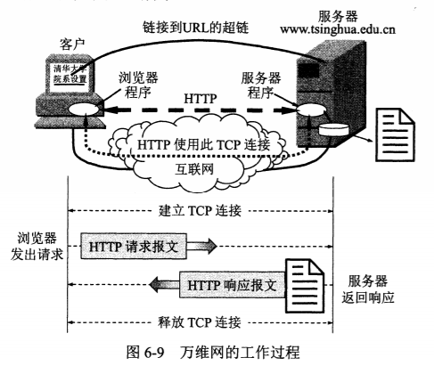
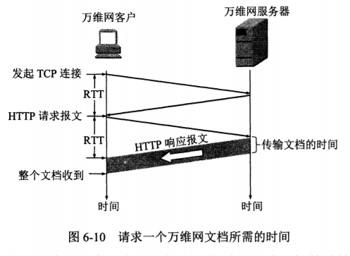

# 应用层协议 application layer protocol

通过位于不同主机中的多个应用进程之间的通信和协同工作来完成，进程之间的这种通信必须遵循严格的规则

- 应用进程交换的报文类型，如请求报文和响应报文
- 各种报文类型的语法，报文中的各种字段和详细描述
- 字段的语义，包含在字段中的信息的含义
- 进程什么时候，怎么发送报文，以及对报文进行相应的规则

## HTTP 超文本传输协议

## 域名系统 其实就是名字系统

用户访问某台主机时，虽然是通过ip地址访问，但是IP地址的32位长度，很难被记住，因此给ip地址命一个好听又有标志的名字是很有必要的，这就有了ip地址和命名的一一对应问题出现，但是又不能直接使用命名的名字访问目的主机，因为命名的域名是长度不定的。而ip地址是32位固定的比较好解析处理相对容易。
在计算机互联网早期，整个网上就是几百台计算机，那时候的IP地址和域名系统，都写在一个hosts的文件中，用户输入域名就能立马得到对应的IP地址。
**互联网的域名系统DNS被设计成一个联机分布式数据库系统。采用客户服务器方式，DNS使大多数名字都在本地进行解析，即使某个计算机出了故障，也不会影响整个DNS系统的正常运行。**
域名到ip地址的解析是由分布在互联网上的许多域名服务器程序共同完成的，域名服务器程序所在的机器称为域名服务器。

### 域名到ip的解析过程

- 当某个应用程序进程需要把主机名解析为IP地址时，该应用程序就调用解析程序，并成为DNS的一个客户，把带解析的域名放在DNS请求报文段中，以UDP用户数据报文方式发给本地的域名服务器（使用UDP是为了减少开销）。本地域名服务器在查找域名后，把对应的IP地址放在回答报文段中返回，应用进程获得目的主机的IP地址后即可进行通信。
- 若本地域名服务器没有找到该域名的IP地址，则该域名服务器发往下一个其他域名服务器，直到能够找到其他域名对应的IP地址为止。

### 互联网的域名结构

- 在早期的时候使用的是非等级的域名空间，优点是名字简短，但是随着用户爆炸式的增加，用非等级的名字空间管理一个很大的经常变化的名字集合是非常困难的。因此后来采用层次树状结构的命名方式。任何一个连接在互联网上的主机或路由器，都有唯一一个层次结构的名字。 **即域名 domain name** 域这里是指的空间的意思，一个域可以划分为子域，子域还可划分为子域，即有一级域名，二级域名，三级域名等等。
- 例如 mail.cctv.com, 其中 mail是三级域名，cctv是二级域名，com是顶级域名，其中每个标号限制在63个字符但是为了更好记忆我们一般不会超过12个字符，**也是不区分大小写的 CCTV和cctv 是同一个域名，除了连字符-以外，不能使用其他标点符号**
- 域名的书写规则是，最低等级的域名在最左边，最高等级的域名在最右边，整个域名不超过255个字符
- DNS域名是不限制一个域名需要有多少个子域名，也不限制每级域名代表的含义。
- 每一级的域名由上一级的域名管理机构管理，最高的顶级域名有ICANN进行管理。
- 这种方式的域名在整个互联网范围是唯一的，也是容易设计域名查找的机制。
- 域名只是一个逻辑的概念，而32位定长的二进制数更适合机器处理。
- 域名中的“点(.)” 和 ip地址中的"点(.)"是没有半毛钱的关系的。

### 顶级域名的三大类

1. 国家顶级域名cn(中国)、us(美国)、uk(英国)
1. 通用顶级域名com(公司企业)、net(网络服务机构)、org(非盈利性的组织)、edu(教育机构)、gov(政府部门)等等
1. 基础结构域名，这种域名只有一个arpa用于反向域名解析
1. 中国顶级域名为cn, 中国把二级域名划分为 “类别域名”和“行政区域名”

- 类别域名分为七个，ac(科研机构)、com(工，商，金融企业)、edu(教育机构)、gov(政府机构)、net(网络服务机构)、org(非盈利性的组织)、mil(国防机构)
- 行政区域名，各省，自治区，直辖市，北京（bj）上海（sh）

### 域名服务器

1. 根域名服务器，是域名服务器的最高层次，也是最重要的域名服务器，所有根域名服务器都知道所有的顶级域名和ip地址。如果本地服务器不能够解析域名，就首先要向根域名服务器求助，如果所有根域名服务器go die那么互联网也就go die了，全世界已经安装了近600台根服务器，大多数是由专门的域名服务器公司管理或者美国政府部门管理，多数情况下，根服务器不会直接把要查询的域名转换为ip地址，而是告诉本地域名服务器下次应该查询哪个顶级域名服务器。
2. 顶级域名服务器，顶级域名服务器负责管理该域名下的所有二级域名服务器，当收到DNS查询请求时，就给出相应的回答，这个回答可能是下一步应当找的域名服务器ip地址，也可能是最后的结果。
3. 权限域名服务器，负责一个区的域名服务器, 当这个域名服务器还不能给出最后的查询结果时，就会告诉发出请求的DNS客户，下一步应该找哪一个权限域名域名器
4. 本地域名服务器，每一个互联网服务商isp, 一个大学，一个医院，都有本地域名服务器，这种域名服务器有时候是默认域名服务器
5. 在windows系统中在，控制面板-->网络和Internet-->网络和共享中心-->查看网络状态和任务-->无线网络连接——>属性-->Internet协议版本4-->属性，这里可以看到首选DNS服务器和备用DNS服务器，这里的DNS服务器指的就是本地域名服务器。
6. 本地服务器距离用户比较近，一般不会超过几个路由器的距离。

## 域名解析过程

- **主机向本地域名服务器的查询一般都是采用递归查**，意思就是本地服务器如果没有找到域名对应的ip地址，那么本地域名服务器就充当DNS客户，向下一个域名服务器查询域名对应的ip地址，直到找到为止。
- 还有一种就是，**本地域名服务器向根域名服务器的查询通常是采用迭代查询**，迭代查询的特点是：当根域名服务器收到本地域名服务器发出的迭代查询请求时，要么给出查询的IP地址，要么告诉本地域名服务器下一个应该查询哪一个域名服务器，然后本地域名服务器在查询根据根域名服务器给的顶级域名服务器ip地址，这样迭代查询。

## 远程终端协议 TELNET telnet

用户用Telnet就可在其所在地通过TCP连接注册到远程的另一台主机上（使用主机名或者ip地址），Telnet能够将用户的输入设备和远程的主机连接，同时远程的主机的输出也能通过TCP连接显示在用户屏幕上，这种服务是透明的，就好像用户的主机和远程的主机是相连接的。称这种连接方式是**终端仿真协议**

## 文件传送协议

FTP 文件传送协议 FTP （file transfer protocol）是使用最广的文件传送协议。FTP协议是基于TCP可靠报文传输协议的
TFTP 简单文件传送协议 （trivial file transfer protocol） 是基于UDP报文段的传送协议。

## 万维网 www (world wide web) 是一个大规模的联机式的信息储存所，可以很方便的从互联网上一个站点访问另一个站点，主动获取非常丰富的信息资源

正是因为万维网的出现，使得互联网呈现爆炸式的增长，普通人也可以通过互联网获取信息资源。
万维网最初是欧洲粒子物理实验室提出的 ，93年推出第一个图形界面版的浏览器器browser Mosaic, 随后95年网景公司推出
netscape navigator 浏览器上市，但是目前装机最多的还是 internet explorer

万维网是一个分布式的超媒体系统，他是超文本系统的扩充，超媒体和超文本区别是：超媒体包含：文本，图形，图像，音频，视频，动画等等，而超文本系统仅仅包含文本信息

分布式和非分布式的系统也有很大区别： 非分布式的各种信息资源都是放在单个计算机的磁盘中。

## 万维网解决的三个基本问题

- 使用URL（统一资源定位符）标志分布在整个互联网上的万维网文档
- 使用HTTP（超文本传输协议）实现万维网上的各种链接
- 使用HTML（超文本标记语言）统一万维网的文档编写格式

### URL 统一资源定位符 <协议>://<主机>:<端口>/<路径>

协议规定用什么协议来访问该万维网，HTTP，FTP等等，主机这里是指的域名，端口和路径有时可省略
在浏览器地址栏输入url时，可省略协议号和www, 直接输入bai.com, 浏览器自动会补全https://wwww.baidu.com
url是部分大小写的

## HTTP 超文本传输协议 HTTP

1. HTTP 是面向事务的应用层协议

2. 每个万维网网店的web服务器进程，他不断的监听TCP的端口80, 用于发现是否有浏览器向它发送连接请求，一但发现连接建立请求并建立了TCP连接之后，浏览器就向万维网服务器发出浏览某个页面的请求，服务器接着就返回所请求的页面作为响应，最后TCP姐俩就被释放了，这个浏览器和服务器的请求和响应的交互，必须按照HTTP超文本传输协议来进行。
3. HTTP使用了面向连接的TCP作为运输层协议，保证了数据的可靠性，但是HTTP协议本身是无状态的、无连接的，因此在交换HTTP报文之前不需要先建立HTTP连接，97年之前使用的是HTTP1.0, 现在使用的是HTTP1.1版本
4. HTTP是无状态的，因此第一次连接和第N次连接是一毛一样的
5. 从浏览器请求一个万维网文档到手当整个文档所需的时间，即发送请求到得到响应的时间，首先要建立TCP连接这需要三次握手，当建三次握手的前两部分完成后(RTT), 浏览器就把HTTP请求报文发给服务器，作为建立TCP连接的三次报文握手中的第三个报文的数据。发送给万维网服务器，服务器接收到HTTP请求报文后，就把所请求的文档作为响应报文返回给客户
   

### 先说HTTP1.0的缺点，从上面可以看出每次请求一个文档就要花费两个RTT的时间
