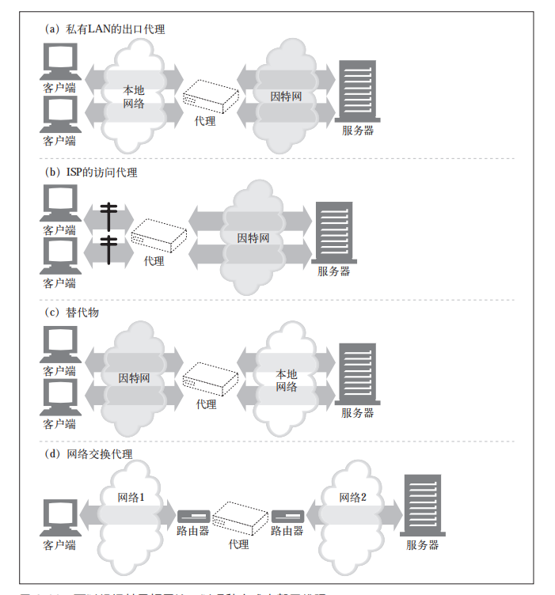

# web代理服务器，在web客户端和web服务器之间充当中间人的身份，在各端之间来回传送HTTP报文

HTTP 的代理服务器既是 Web 服务器又是 Web 客户端。HTTP 客户端会向代理发送请求报文，代理服务器必须像 Web 服务器一样，正确地处理请求和连接，然后返回响应。同时，代理自身要向服务器发送请求，这样，其行为就必须像正确的 HTTP客户端一样，要发送请求并接收响应。如果要创建自己的 HTTP 代理，就要认真地遵循为 HTTP 客户端和 HTTP 服务器制定的规则。

## 代理分，私有代理，公共代理

- 公共代理，绝大多数都是公共代理的，比如高速缓存代理服务器，会利用用户间共同的请求，这样的话，汇入同一个代理服务器的用户越多，它就越有用。

- 专用的私有代理并不常见，但它们确实存在，尤其是直接运行在客户端计算机上的时候。

### 代理和网关的对比

严格来说，代理连接的是两个或者多个相同的协议的应用程序，而网关连接的是两个或者多个不同协议的端点。
网关扮演是 “协议转换工具” 即使客户端和服务器使用的是不同的协议，客户端也可以通过它完成与服务器之间的事务处理。

### 是什么原因让你选择代理服务器

代理服务器可以提高安全性，提高性能，节省费用，代理服务器可以看到所有的HTTP流量，并对流量进行控制和监视

- 儿童过滤器，利用过滤代理服务器阻止未成年访问成人网站。

- 文档访问控制，中国大陆禁止访问google, facebook, 等国外文档站点

- 安全防火墙 网络安全工程师通常会使用代理服务器来提高安全性。代理服务器会在网络中的单一安全节点上限制哪些应用层协议的数据可以流入或流出一个组织。

- web缓存，代理缓存维护了常用文档的本地副本，并将它们按需提供，减少互联网的通信资源

### 代理服务器的部署，根据代理服务器的用途，可以将代理服务器部署到任何位置

- 出口代理，可以将代理固定在本地网络的出口点，以便控制本地网络与大型因特网之间的流量。可以在公司网络中使用出口代理，提供针对公司外部恶意黑客的防火墙保护，或降低带宽费用，提高因特网流量的性能。小学可能会使用过滤出口代理来防止早熟的学生浏览不恰当的内容。

- 访问（入口）代理， 代理常被放在 ISP 访问点上，用以处理来自客户的聚合请求。ISP 使用缓存代理来存储常用文档的副本，以提高用户（尤其是高速连接用户）的下载速度，降低因特网带宽耗费

- 反向代理， 代理通常会被部署在网络边缘，在 Web 服务器之前，作为替代物（也常被称为反向代理）使用，在那里它们可以处理所有传送给 Web 服务器的请求，并只在必要时向 Web 服务器请求资源。替代物可以提高 Web 服务器的安全特性，或者将快速的 Web 服务器缓存放在较慢的服务器之前，以提高性能。反向代理通常会直接冒用 Web 服务器的名字和 IP 地址，这样所有的请求就会被发送给代理而不是服务器了。

- 网络交换代理，可以将具有足够处理能力的代理放在网络之间的来减轻因特网节点的拥塞，并对流量进行监视

