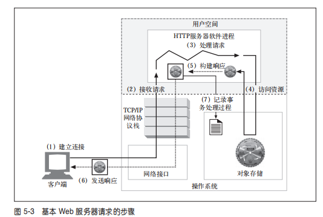

# web 服务器的实现

1. web服务器实现了HTTP和相关的TCP连接处理
2. 负责管理web服务器上的资源
3. web服务器的配置，扩展，控制管理等

web服务器逻辑实现了HTTP协议，管理web资源，并负责提供web服务器的管理功能，web服务器逻辑和操作系统共同负责管理TCP连接，底层操作系统负责管理底层计算机系统的硬件细节，并提供了 TCP/IP 网络支持、负责装载 Web 资源的文件系统以及控制当前计算活动的进程管理功能。

## 常规web服务器会做什么

1. 建立连接，接受一个客户端的连接，或者不希望连接就将其关闭
2. 接收请求，从网络中读取HTTP报文请求
3. 处理请求，对HTTP报文进行解析，处理请求
4. 访问资源，访问报文中指定的资源
5. 构建响应，创建带有正确首部的HTTP响应报文
6. 发送响应，将响应回送给客户端
7. 记录事务处理过程，将已完成实物有关的内容记录在一个日志文件中

## 连接的输入、输出处理结构

高性能的web服务器能够同时支持数千条连接，这些连接能够处理世界各地的客户端进行通信，因为请求可能会在任何时刻到达，所以web服务器必须不停的监听观察有无新的web请求，不同的web服务器结构会以不同的方式为请求服务
1. 单线程的web服务器
单线程web服务器，一次只处理一个请求直到完成为止，一个事务处理结束之后，才去处理下一条连接，性能有很大问题
2. 多进程及多线程web服务器
多进程和多线程web服务器用多个线程，或者更高效的线程同时对请求进行处理，可以根据需要创建，或者预先创建一些线程和进程，有些服务器会为每条连接分配一个线程、进程，会消耗服务器的内存和系统资源，因此，很多多线程web服务器会对线程/进程数进行数量的限制。
3. 复用I/O的服务器
为了支持大量的连接，很多web服务器都采用了复用结构，在复用结构中要同时监听所有连接上的活动。
4. 复用的多进程web服务器