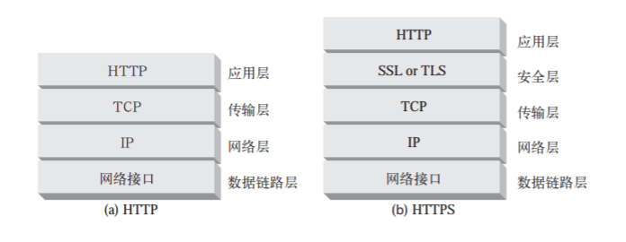
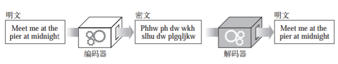
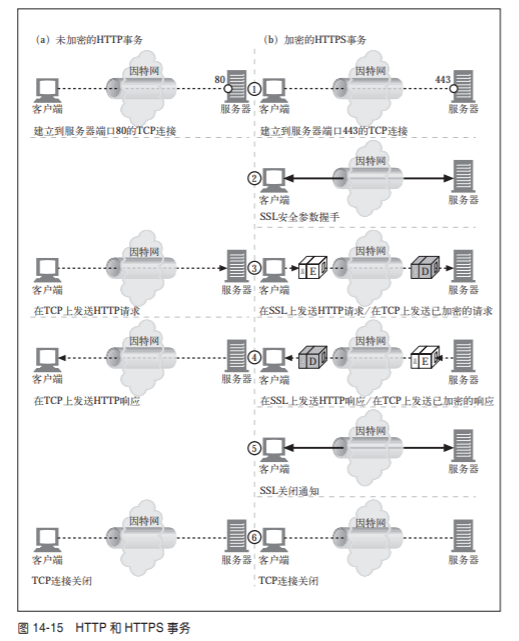

# 安全 HTTP

使用基本认证和摘要认证和报文完整性检查的轻量级方法对很多网络事务都是很实用的，但是对于银行事务，安全性要求高的事务，必须使用HTTP和数字加密技术结合起来使用，才能确保安全

## 保护 HTTP 的安全

- 服务器认证（客户端知道他们是在和真正的服务器通信而不是伪造的服务器通信）
- 客户端认证 （服务器知道他们是在和真正的客户端通信，而不是伪造的客户端）
- 完整性 （客户端和服务器的诗句不会被修改）
- 加密 （客户端和服务器的对话是私密的，不会被窃听）

HTTPS 是最流行的HTTP安全形式，由网景公司首次提出，所有主要的浏览器和服务器都是支持此项协议的, HTTPS 使用 https:// 而不是http://

使用HTTPS时所有的HTTP请求和响应数据在发送到网络之前，都要进行加密。HTTPS在HTTP下面使用了一个传输级的密码安全层 -- 可以使用 SSL 也可以使用 transport layer security TLS 

所以大部分的困难的编码及解码工作都是在SSL库中完成的，所以web客户端和服务器在使用安全HTTP时无需过多的修改协议处理逻辑，在大多数情况下，只需要用SSL的输入，输出调用取代TCP的调用，在增加其他几个调用来配置和管理安全信息就行了。

## 数字加密

- 密码 对文本进行加密编码
- 密钥 改变密码行为的数字化参数
- 对称秘钥加密系统，编码和解码使用相同秘钥的算法
- 不对称秘钥加密系统，编码和解码使用不同秘钥算法
- 数字签名，数字证书

### 密码是一种名为密码的秘密代码

### 使用了秘钥的密码
编码算法和编码机都可能会落入别人手里，所以大部分机器都有一些号盘，可以将其设置为大量不同的值来改变密码的工作方式，即使机器丢了，没有正确的号盘设置（秘钥值）解码器也是无法工作的。这些密码参数称为秘钥

### 用证书对服务器进行认证
通过HTTPS建立了一个安全web事务之后，现代的浏览器都会自动获取所连接服务器的数字证书，如果服务器没有证书，安全连接就会失败，服务器证书中包含很多字段：
1. web站点的名称和主机名
2. web站点的公开秘钥
3. 签名办法机构的名称
4. 来自签名办法机构的签名

浏览器收到证书时会对签名颁发机构进行检查，如果这个机构是个很有权威的机构那么浏览器很可能已经知道了公开秘钥，如果对签名颁发机构一无所知，那么浏览器会弹出一个对话框，让用户是否相信这个签名发布者

### 建立安全传输
在为加密的HTTP中，客户端会打开一条到web服务器端口80的TCP连接，发送一条请求报文和接收一条响应报文，关闭连接。
如果SSL安全层的存在，HTTPS中这个过程会稍微复杂一些，HTTPS客户端首先打开一条到web服务器端口443的连接，一旦建立tcp连接，客户端和服务器就会初始化ssL层，对加密参数进行沟通，并交换秘钥，握手完成后，SSL初始化就完成了，客户端就可以在请求报文发送给安全层了，在将这些报文发送给TCP之前，要先对其进行加密

### SSL 握手
在发送加密的HTTP报文之前，客户端和服务器要进行一次SSL握手：

### 服务器证书

SSL支持双向证书，将服务器证书承载给客户端，再将客户端的证书回送给服务器，但是浏览时并不是经常使用客户端证书，大部分用户甚至都没有自己的客户端证书，服务器可以要求使用客户端证书，但实际中很少出现这种情况。还有就是**安全的HTTPS事务总是要求服务器证书。** 在一个web服务器上执行安全事务，例如提交信用卡时，我们都是希望服务器证书是由权威机构签发的服务器证书来提升我们对服务器的信任度。

### OpenSSL 是SSL和TLS最常见的开源实现，OpenSSL 项目由一些志愿者合作开发，目标是开发一个强壮的、具有完备功能的商业级工具集，以实现 SSL 和 TLS 协议以及一个全功能的通用加密库