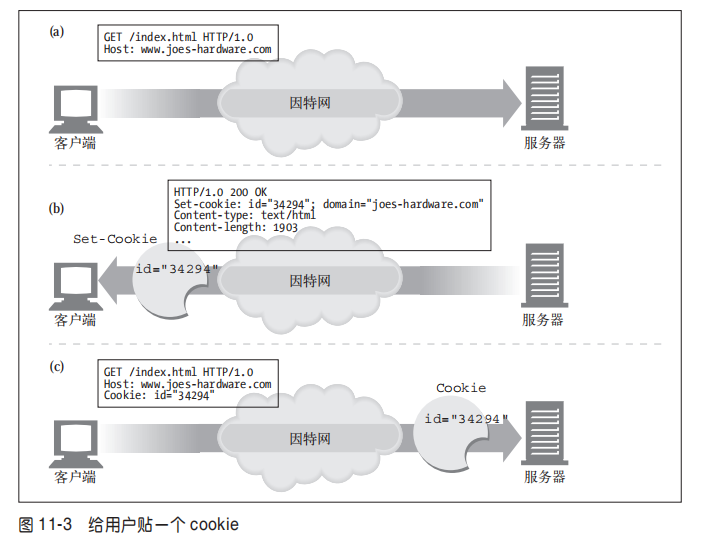
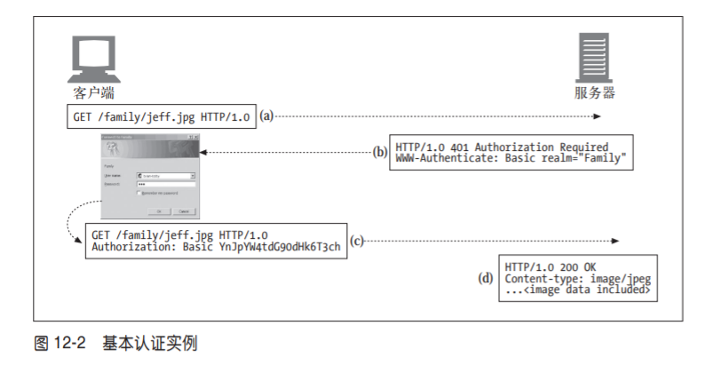

# web服务器可能会同时与数千个连接的客户端进行通信，这些服务器需要记录一下他们正在与谁交谈而不认为所有的请求都是来自匿名的客户端

## 个性化接触

HTTP最初是一个匿名，无状态的请求/响应协议,服务器处理来自客户端的请求，然后向客户端回送一条响应，web服务器几户没有什么信息可用来判断是哪一个用户发送的请求

现代的web站点希望提供**个性化的服务**,服务器想要了解更多的客户端信息，并且能够在用户浏览器页面时对其进行跟踪

1. 个性化的问候，为不同用户提供不同的页面内容，提供个性化的服务，推荐用户感兴趣的话题，商品，投其所好

2. 记录会话，HTTP事务是无状态，每条请求和响应都是独立的，很多web站点都希望能进行增量的信息状态，那么就要有一种方式来区分不同的用户的连接

## HTTP 请求中的首部，可以携带客户端信息

承载用户信息的HTTP请求首部

首部名称 | 首部类型 | 描述
--- | --- | ---
From | 请求 | 用户的 E-mail 地址
User-Agent | 请求 | 用户的浏览器软件
Referer | 请求 | 用户是从这个页面上依照链接跳转过来的
Authorization | 请求 | 用户名和密码
Client-IP | 扩展（请求）| 客户端的 IP 地址
X-Forwarded-For | 扩展（请求）| 客户端的 IP 地址
Cookie | 扩展（请求）| 服务器产生的 ID 标签

## cookie 是实现识别用户，实现持久会话的最好方式

cookie 最早是由网景公司开发的，现在所有浏览器都支持

### cookie 的工作原理

cookie 就像服务器给用户贴的的“嗨，我叫”的贴纸一样。。用户访问一个 Web 站点时，这个 Web 站点就可以读取那个服务器贴在用户身上的所有贴纸。
用户首次访问 Web 站点时，Web 服务器对用户一无所知。Web 服务器希望这个用户会再次回来，所以想给这个用户“拍上”一个独有的 cookie，这样以后它就可以识别出这个用户了。cookie 中包含了一个由名字 = 值（name=value）这样的信息构成的任意列表，并通过 Set-Cookie 或 Set-Cookie2 HTTP 响应（扩展）首部将其贴到用户身上去。

cookie 的基本思想就是让浏览器积累一组服务器特有的信息，每次访问服务器时都将这些信息提供给它。因为浏览器要负责存储 cookie 信息，所以此系统被称为客户端侧状态（client-side state）。

# 基本认证机制

认证就是给出一系列的身份证明，就像出示身份证和护照，证明你就是声称的那个人，现在，那些策略都不是绝对的有效，密码可以被破解，身份证可以被偷走，但每种证据都有助于构建合理的信任，说明你就是你声称的人。

认证协议与首部，HTTP通过一组可定制的首部，HTTP定义两个官方的认证协议，基本认证和摘要认证

## 认证的4个步骤

步骤 | 首部 | 描述 | 方法
--- | --- | --- | --- 
请求 |    | 第一条请求没有认证信息 | get请求
质询 | www-authenticate | 服务器用401状态拒绝请求，说明需要用户名和密码 | 401 Unauthorized
授权 | authorization | 客户端重新发送请求，这次加上authorization首部，用来说明密码和用户名 | get
成功 | authorization-info | 如果授权成功 服务就会将文档返回 | 200 ok

### 基本认证 基本认证是最流行的HTTP认证协议，几乎每个主要的客户端和服务器都实现了基本认证机制

在基本认证中，web服务器可以拒绝一个事务，质询客户端，请用户提供有效的用户名和密码，服务器返回401状态码，而不是200状态码来初始化认证质询，并用www-authenticate 响应首部指定要访问的安全域，浏览器收到质询时，会打开一个对话框，输入用户名和密码，然后将用户名和密码稍加扰乱码，再用authorization 请求首部回送给服务器

基本认证可以用base-64编码对其进行编码，可防止管理员在管理服务器和网络时，不小心看到用户名和密码。但是这个编码扰乱方式还是相对明文的，因为稍加转换就能显示正确的用户名和密码，假冒的服务器很容易骗过基本认证。

### 摘要认证 基本认证灵活但是不安全，用户名和密码都是明文形式传送，没有任何防范措施，安全使用基本认证的唯一方式就是将其与SSL配合使用。

摘要认证与基本认证兼容，更为安全，但是摘要认证还没有得到广泛的应用
摘要认证

- 永远不会以明文方式在网络上发送密码
- 可以防止恶意用户捕获并重放认证的握手过程
- 可以有选择的防止对报文内容的篡改
摘要认证并不是最安全的认证，摘要认证不能满足HTTP事务的很多需求，使用传输层安全
transport layer security TLS 和安全HTTP （secure HTTP HTTPS）协议更安全一些